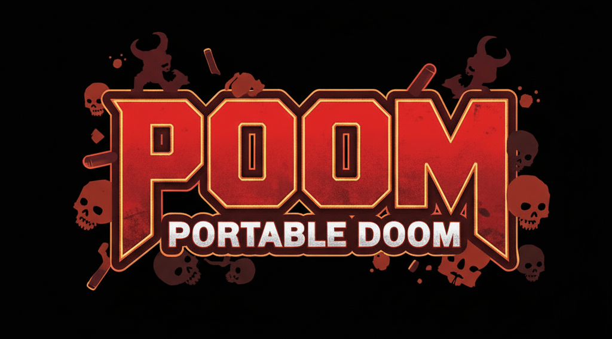

<p align="center">
<br/><br/>
</p>

Poom (Portable Doom) is a simple tool for creating customized, self contained Doom executables running on [UZDoom](https://github.com/UZDoom/UZDoom) and [GZDoom](https://github.com/ZDoom/gzdoom) sourceports. You can run these as is or use them for testing custom community WADs.


## Installation

Poom ships with 2 versions, depending which source port you want to use:

- UZDoom - [poom-uzdoom.zip](https://github.com/exaroth/poom/releases/download/stable/poom-uzdoom.zip)
- GZDoom - [poom-gzdoom.zip](https://github.com/exaroth/poom/releases/download/stable/poom-gzdoom.zip)

Download the version of your choice and unzip

## Usage

```
Usage: poom <options>

Options:
  -f, --file          Path to pk3 or wad file to include.
  -w, --base-wad      Path to base wad/pk3 file.
  -h, --help          Print help.
```

To build custom Doom instance add list of WADs/pk3s you want to include via `-f` parameter as well as base Doom WAD (eg. the one included with Doom 1 or Doom 2 game). For example to build Doom executable running with Brutal Doom mod and custom OST run:

```
./poom -f ./brutal_doom.pk3 -f /path/to/OST.WAD -w DOOM2.WAD
```

> [!IMPORTANT]
> :warning:   Doom builder will use shareware version of Doom by default if proper Doom 1/2 WAD is not provided via `--base-wad` parameter. Shareware version does not allow for using custom WAD files.

Doom Builder will create `doom` instance which, if executed without any parameters, will run Doom with provided custom wad files, additionally you can pass list of additional WADs as positional parameters, eg. using above example:

```
./doom ~/eviternity.wad
```

Will run Brutal Doom with custom OST and Eviternity mod.

## License

See `LICENSE` file for details
